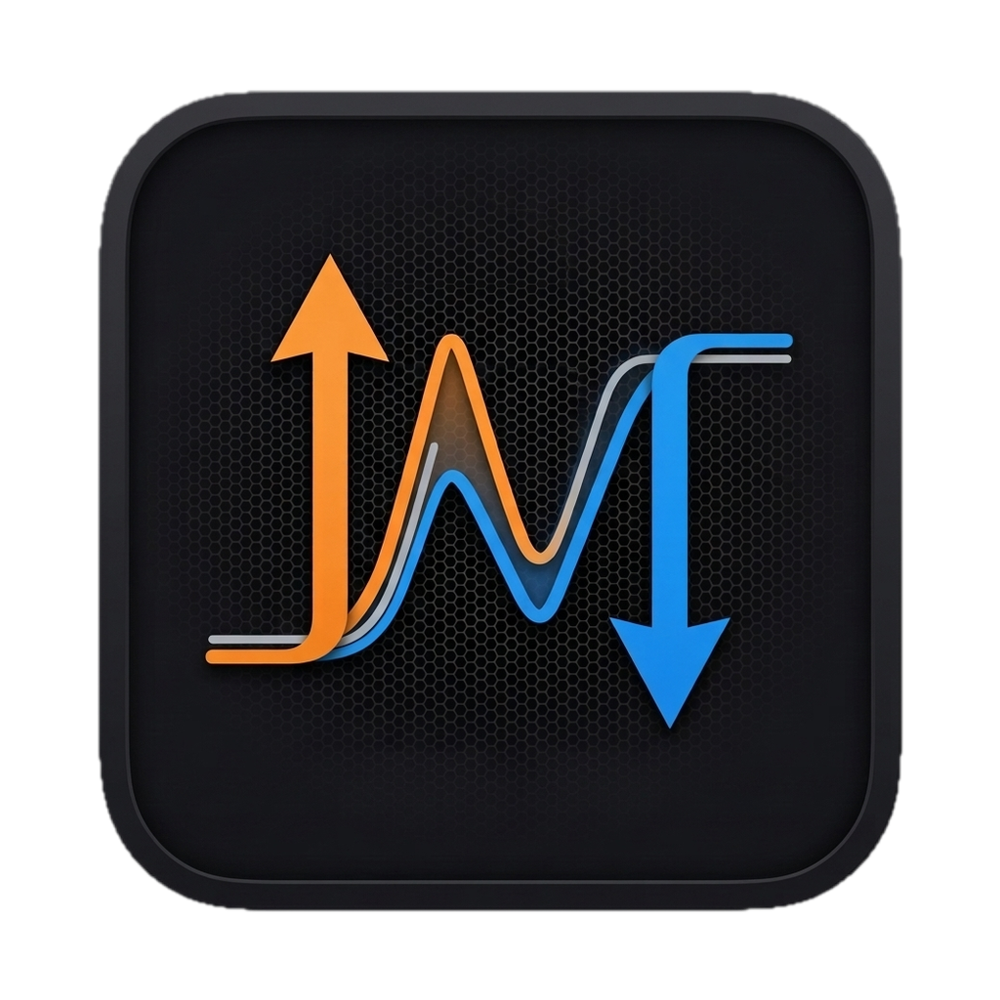

<p align="center">
  
</p>

<h1 align="center">NetPulse</h1>

<p align="center">
  Real-time upload &amp; download speed, right in your Mac's menu bar.
</p>

> ⚠️ **Do not delete this repository.** This repo hosts NetPulse's source code *and* its GitHub Releases — the [`homebrew-netpulse`](https://github.com/anujhabuild/homebrew-netpulse) tap downloads the app `.zip` directly from a release here. Deleting this repo (or its releases) breaks `brew install --cask netpulse` and `brew upgrade --cask netpulse` for everyone, with no separate backup copy elsewhere.

## Why NetPulse

Most bandwidth monitors are bloated, drain your battery, or (ironically) use the network themselves just to tell you how much network you're using. NetPulse doesn't.

- **Zero network overhead.** NetPulse never sends a single packet to measure your speed. It reads the byte counters your Mac's kernel already tracks for every network interface — the same passive mechanism Activity Monitor uses — and does the math locally. No pings, no probes, no phoning home.
- **Genuinely lightweight.** Built natively in Swift and AppKit, not Electron. No bundled browser, no background renderer process — just a tiny native menu bar item.
- **Real-time, at a glance.** Live upload and download speed, updated every second, formatted the way you'd expect (`B/s` → `KB/s` → `MB/s` → `GB/s`), sitting right where you'd look for it.
- **Actually native.** A proper `NSStatusItem`, not a SwiftUI approximation — same spacing and behavior as Wi-Fi, Bluetooth, and every other system menu bar icon. Drag it, reorder it, it just fits in.
- **More than a number.** Click it for a popover with independently-scaled live sparklines for upload and download (so a download spike never hides your upload activity), total session data usage, and the active network interface(s) in use.
- **Your choice on login.** An in-app toggle to launch at login — off by default, on if you want it.
- **Private by design.** No accounts, no analytics, no telemetry, no data ever leaves your Mac. There's nowhere for your data to go — the app doesn't talk to the network at all.

## Install

```
brew tap anujhabuild/netpulse
brew install --cask netpulse
```

NetPulse isn't code-signed/notarized yet, so on first launch macOS will block it as being from an "unidentified developer." Right-click `NetPulse.app` in `/Applications` and choose **Open** once — after that it launches normally every time.

## Features at a glance

| | |
|---|---|
| 📊 Live speed | Upload/download shown inline in the menu bar, refreshed every second |
| 📈 Session graph | Independently-scaled sparklines for upload and download in the popover |
| 🧮 Session total | Cumulative data transferred since launch |
| 🌐 Interface aware | Shows which interface(s) — Wi-Fi, Ethernet — are currently active |
| 🚀 Launch at login | Optional, user-controlled, off by default |
| 🪶 Native & minimal | Swift + AppKit, no Electron, negligible CPU/memory footprint |
| 🔒 Fully local | No network calls, no telemetry, no accounts |

## License

MIT — see [LICENSE](LICENSE).
